# XDF 2018 Workshop 
# Machine Learning for Embedded

## Introduction
Welcome to the XDF 2018 machine learning for embedded workshop. During this session you will gain hands-on experience with Deephi DNNDK, and learn how to quantize, compile and deploy pre-trained network models to Xilinx embedded SoC platforms. 

### Overview of DNNDK flow
The architecture DNNDK and its development flow are pictured below:

**Elements of DNNDK:**
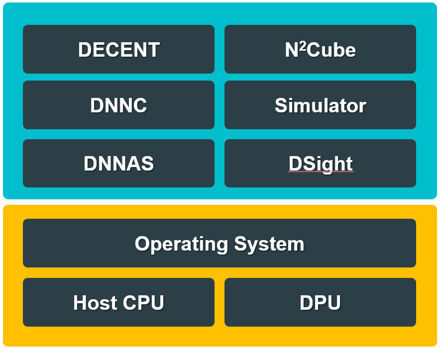

**DNNDK Flow:**


**DNNDK Compilation Process:**
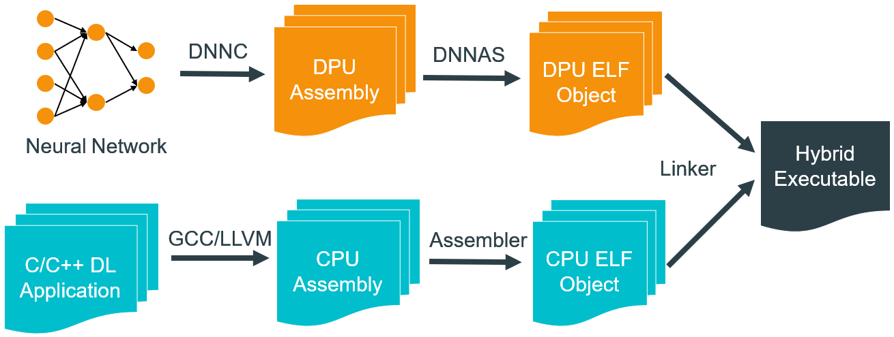

1. DNNDK is a tool suite which is designed specifically to deploy deep neural networks(DNNs) to Xilinx FPGA platforms with high efficiency and productivity.
2. DNNDK is comprised of quantizer, compiler, assembler, linker, and other useful utilities such as profiler, simulator and run-time libraries to increase the productivity of developing DNN applications with Xilinx embedded platforms.
3. An embedded DNN application consists of a hybrid executable including Deephi Deep-learning Processing Unit (DPU) kernels in the programmable logic(PL) region and CPU kernels in the processor(PS) of Xilinx embedded SoC. 
4. DNNDK provides high-level user-space APIs in C++ to hide the low-level details for machine learning algorithm and application developers.

### Overview of the Machine Learning for Embedded Workshop modules

This developer workshop is divided into 4 modules. You should complete each module before proceeding to the next.
1. **Connecting to your P2 instance**
    
    You will start an EC2 P2 instance where DNNDK tool and project files are located and connect to it using SSH or remote desktop client. 
2. **Experiencing DNNDK with Resnet50**
    
    Let us start with a classical image classification example. In this module you experienced the quantization, compilation and deployment of pretrained Resnet50 with DNNDK for Xilinx embedded platform
3. **Go further with SSD**
    
    The object detection is a common task for embedded machine learning. You will build a real-time multi-class object detection demo using SSD network in minutes. 
4. **Wrap-up and next steps**

    Explore next steps to continue your DNNDK experience after the machine learning for embedded Workshop.

For your convenience, all the modules of this Developer Workshop will use the script and dataset which have been prepared for you.

## Connecting to your P2 instance
In this module you will start an EC2 P2 instance and connect to it using SSH or remote desktop client. Once connected, you will be able to use the tool with all needed scripts and dataset.
For this event, each registered participant will be required to start an EC2 P2 instance, therefore, participants need to have experience with:
* AWS account and launching EC2 instances
* Connecting to a running instance using SSH or Windows Remote Desktop

### Log in AWS and start the instance
1. User your web browser to visit https://console.aws.amazon.com/console/home

**AWS Login:**
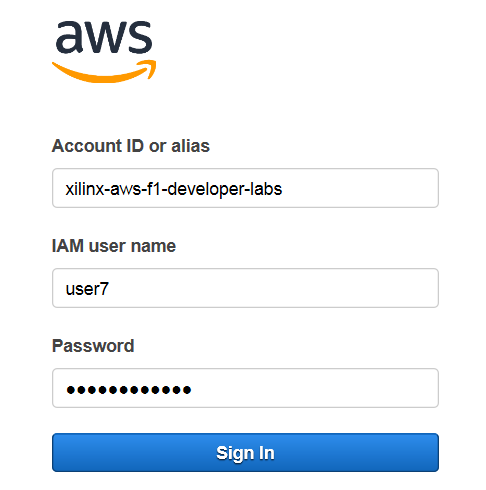

2. Login in with the assigned Account ID, user name and Password as shown. 
If you don't have it, please raise your hand and ask for help.
             
3. You will see a list of instances. Select the instance associated with your user name, click __*Actions > Instance State > Start*__. Then click Yes, start button in the Start Instances dialog. 
   
**AWS Instances:**


4. The startup time is about 10 ~20 seconds and you need to refresh the browser to see the status update. You will see the instance state becomes running and there is an Ipv4 public IP address associated with it. Later, you will use this IP address for SSH or Remote Desktop Connection to access the working directory. 

**AWS Instance Runing:**


There are two ways to connect to the instance - SSH and RDP. Directions for both follow.

### Connect to your instance using SSH
1. In the SSH client, use the IPv4 Public IP of your instance:
```
 ssh -i ubuntu@<IPv4 Public IP>
```

**SSH Client:**
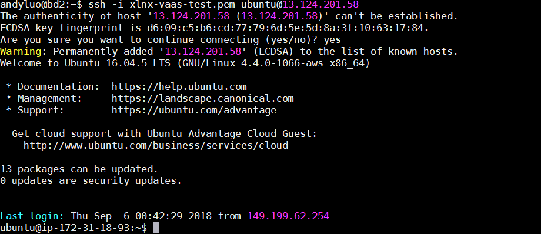

2. Go to the the working directory 
```
cd ~/Compiler
ls
```

You will see the following. 

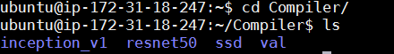

You can see there are four folders which are respectively, 
* ~/Compiler/inception_v1: lab files for inception_v1 aka Googlenet 
* ~/Compiler/resnet50: lab files for Resnet50
* ~/Compiler/ssd: lab files for SSD
* ~/Compiler/val: image files for calibration and test


### Connect to your instance using a remote desktop client
The instance you just started should now be configured with remote desktop protocol (RDP) services.
1. From your local machine, start a remote desktop protocol client
* On Windows: press the Windows key and type "remote desktop". 
    * You should see the "Remote Desktop Connection" in the list of programs.
    * Alternatively you can also simply type mstsc.exe in the Windows run prompt.
* On Linux: RDP clients such a Remmina or Vinagre are suitable.
* On macOS: use the Microsoft Remote Desktop from the Mac App Store.
2. In the RDP client, enter the IPv4 Public IP of your instance.
3. IMPORTANT: Before connecting, set your remote desktop client to use 24-bit or less for color depth
* On Windows: In the bottom-left corner of connection prompt, click Options, then select the Display tab and set Colors to True Colors (24 bit)
4. Click Connect. This should bring up a message about connection certificates.
5. Click Yes to dismiss the message. The Remote Desktop Connection window opens with a login prompt.
   
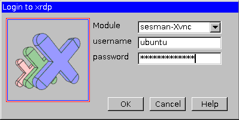

6. Login with the following credentials:
* User: ubuntu
* Password: awslabs_2018

    Click Ok. The RDP connection may fail on the first login, press OK and re-login. You should now be connected to the remote P2 instance running Ubuntu.

7. Open a new terminal as below. 

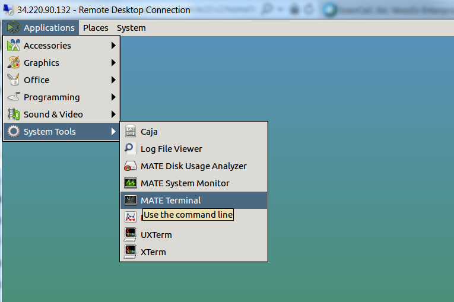

8. Go to the working directory 
```
cd ~/Compiler
ls
```
You will see the following:  
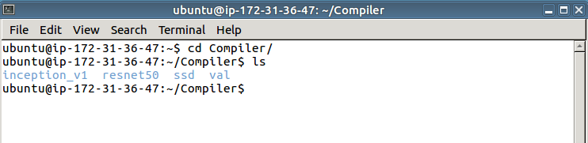

Now you've connected to the P2 instance and know the location of the working directory. Let us move to the next step. 


## Experiencing DNNDK with Resnet50

In this module you will have a hands-on experience of Deephi DNNDK to quantize, compile,and deploy to Xilinx ZU102 board with a pre-trained Resnet50 network. 

Resnet50 (https://arxiv.org/abs/1512.03385) is an image classifier trained with the Imagenet dataset. 
You will go through the following steps,
1. Quantization to generate the fixed-point network model
2. Compilation to generate DPU kernels
3. View main.cc written with DNNDK APIs
4. Hybrid compilation to produce the executable for [XXX] board
5. Run it on [xxx] board to see the result

Look into ~/Compiler/resnet50: 

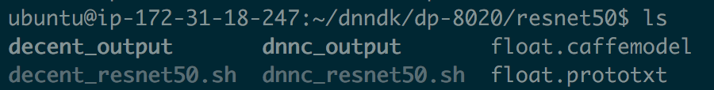

 The directories and files are organized as follows, 

* float.prototxt: 	pre-trained Caffe network model file to describe the network structure and parameter of each layer
* float.caffemodel:	pre-trained Caffe float-point (FP32) weight file
* decent: Deephi's quantization tool
* dnnc:	DeephiNeural Network Compiler
* decent_resnet50.sh: script for Resnet50 quantization
* dnnc_resnet50.sh: script for Resnet50 compilation
* decent_output: the output folder of Resnet50 quantization
* dnnc_output: the output folder of Resnet50 compilation

The directory and file arrangement of Inception_v1 and SSD are very similar. 

If you have interest, feel free to have a look into float.prototxt in ~/Compiler/resnet50/

The first layer on top is ImageData type with calibration images for the quantization. DNNDK does not support the mean file e.g. mean.binaryproto. Instead we use 3 mean values as shown below. 

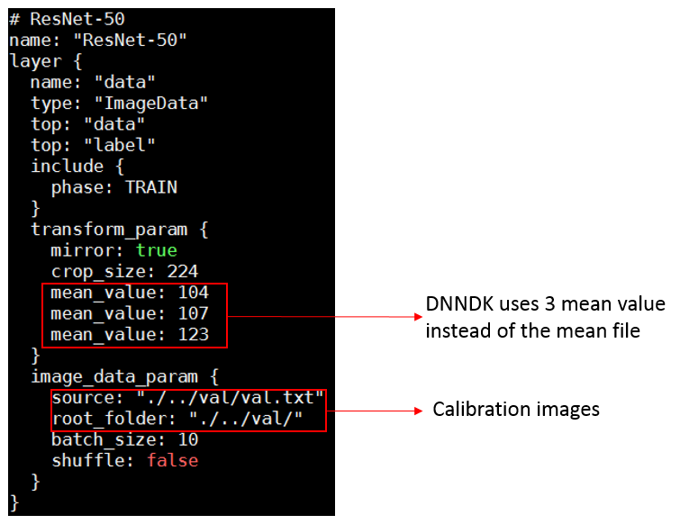

At the bottom of float.prototxt, two 'Accuracy' type layers have been added to compute top-1 and top-5 accuracy. 

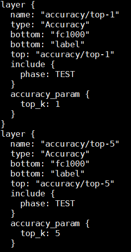

### Quantization with decent

decent is used to convert a pre-trained floating point (FP32) network model to a fix-point (INT8) model without hurting the accuracy. Using 8-bit calculations help your models run faster and use less power. This is especially important for many embedded applications that can't run floating point code efficiently.

The network models we use are trained by Caffe. DNNDK toolchain support for Tensorflow will come soon. 

We've created a script decent_resnet50.sh for you. 

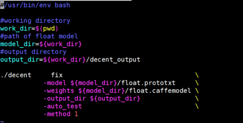

The command above quantizes the float-point model and automatically checks the accuracy of the quantized model.

Run decent: 
```
./decent_resnet50.sh
```

It takes about 4 minutes to complete.

During the execution, you can see some output information scrolling on the screen. The figure below shows how DNNDK uses calibration technique to measure the dynamic range of each layer without the time-consuming retrain process. 
          
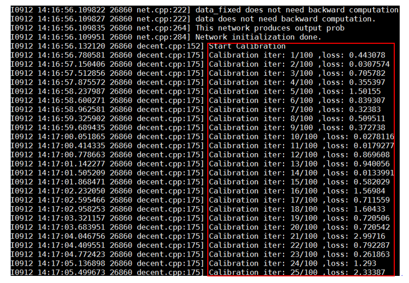
          
At the end, it checks the accuracy of the quantized model and generates the deploy.prototxt and deploy.caffemodel which are the input to the next step. 

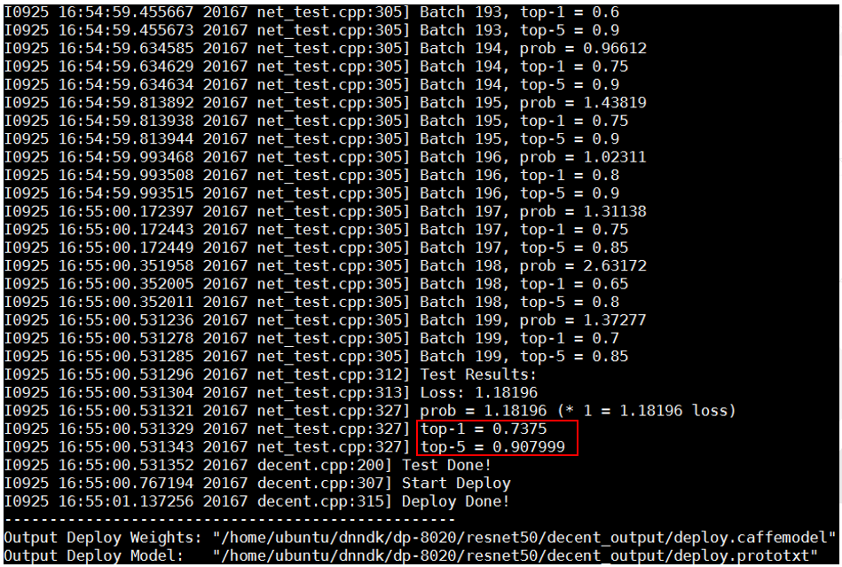
          
This concludes the quantization process. We successfully quantized the float-point Resnet50 model to the fix-point model and achieved with a good accuracy (top-1 0.835, top-5 0.955) vs float-point accuracy (top-1 ?, top-5 ?). The decent quantization is simple, fast and accurate. 

Let us go to the next step. 


### Compilation with dnnc

In this step, you will use dnnc, Deephi Nerual Network Compiler, to compile the quantized fixed-point model into DPU kernels which are ELF format object files containing the DPU instructions and parameters for the network model. Please note DPU is Deephi's Deep Learning IP core for Xilinx FPGA devices.

The DNNDK compilation has two phases:the 1st phase happens in host side where dnnc takes place;the 2nd phase, which is the hybrid compilation, happens in target board side where we link all the DPU and CPU elf object files and other necessary libraries (including DNNDK libraries) to generate the final executables. 

At this time, you will go through the 1st phase. 

A script dnnc_resnet50.sh has been created. 

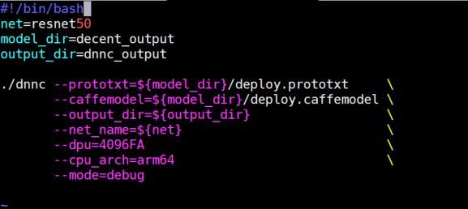

If you want to understand the meaning of the parameters of dnnc, just run ./dnnc

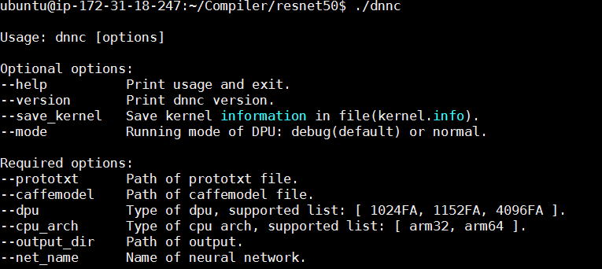

In this case, we target ZCU102 platform which uses Cortex-A53 based ZU9EG device, so the option 'arm64' is used and the DPU IP core option 'B4096A' is chosen for dnnc. The details of the DPU IP core are beyond the scope of this workshop. Contact Xilinx for further info. 

Run dnnc:
```
./dnnc_resnet50.sh 
```

It takes about 1 minutes to complete. 4 kernels are generated. Kernel resnet50_0 and resnet50_2 will run on DPU, including CONV, BN, POOL, RELU, FC layers while Kernel resnet50_1 and resnet50_3 will run on ARM to implement the layers of average pooling and softmax respectively. 

In general, if a certain layer cannot run on DPU, it will be executed on ARM. So the networks will be automatically partitioned into several segments by the dnnc compiler. Each segment corresponds to one kernel, either in DPU or CPU. 

Please contact Xilinx if you want to know if any specific layer has been supported by DNNDK/DPU. The details of layer support are beyond the scope of this workshop.
          
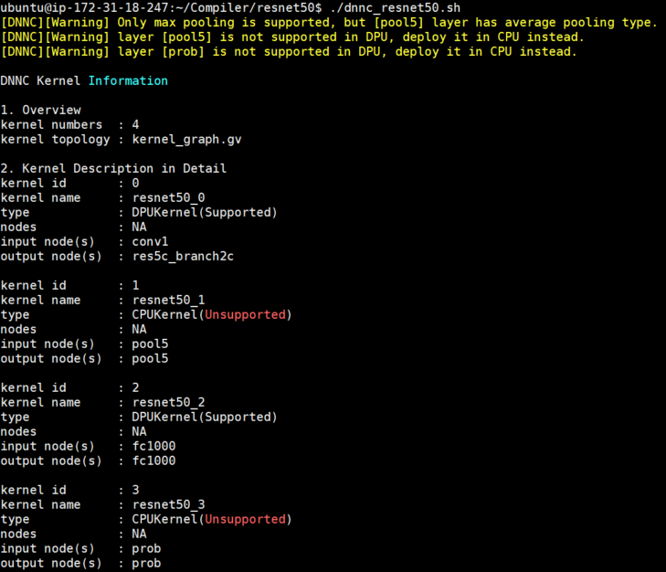
    
dpu_resnet50_0.elf and dpu_resnet50_2.elf are generated in dnnc_output folder, which are the output of dnnc. Each corresponds to one DPU kernel described previously. These elf files will be used in the next phase to generate the final executables.

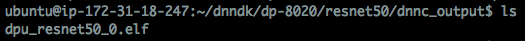

## Use DNNAK APIs to program Resnet50 in main.cc 

To simplify the machine learning application programming, high-level DNNDK APIs written in C++ are provided for developers to write a main.cc file. The main.cc is in charge of DPU kernel management, CPU kernel implementation as well as the interaction between kernels and the system such as video peripherals. 

main.cc file for Resnet50 is in [path TBD]

Examine the code in main.cc to get familiar with DNNDK APIs. The following shows a code snippet of function main() in main.cc:

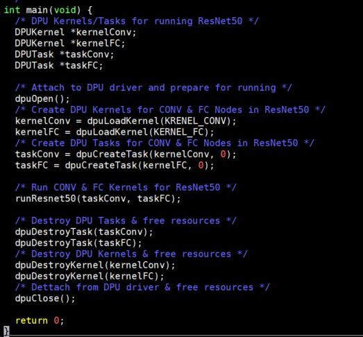
    
The main operations are: 
* Call __dpuOpen()__ to open DPU device
* Call __dpuLoadKernel()__ to load DPU kernel resnet50_0 & resnet50_2 generated by dnnc
* Call __dpuCreateTask()__ to create task for DPU kernel resnet50_0 & resnet50_2
* Call __runResnet50()__ to do image classification 
* Call __dpuDestoryTask()__ to destroy Task and free its resources
* Call __dpuDestroyKernel()__ to destroy Kernel and free its resources
* Call __dpuClose()__ to close DPU device 

Please make sure the kernel and node names are aligned with the output log in dnnc compilation, otherwise ???

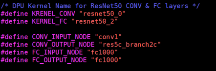
    
The following shows a code snippet of function runResnet50(): 

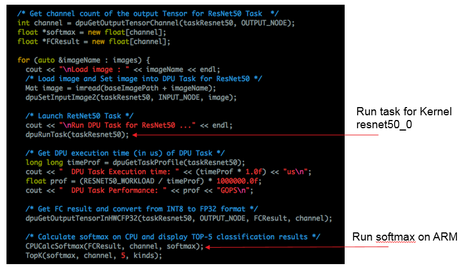

__runResnet50()__ does the following tasks: 
1. Read picture and set it as the input to DPU kernel resnet50_0 by calling __dpuSetInputImage()__ API 
2. Call __dpuRunTask()__ to run taskConv convolution operation 
3. Do Average Pooling operation on CPU using the output of convolution operation as input
4. Call __dpuRunTask()__ to do full connection operation of taskFC on DPU. 
5. Do Softmax operation on CPU using the output of full connection operation as input. 
6. Output the top-5 classification category and the corresponding probability 

For details of DNNDK APIs, please refer to DNNDK User Guide which can be downloaded from Deephi website. 

## Hybrid Compilation & Running on Hardware Board

1. Prepare hardware environment

Xilinx ZCU102 is used as the hardware platform for this workshop. A 16GB SD card which holds the boot image and necessary demo files has been provided as the boot device. 
A 1080p DP monitor is required as the display. A USB UART cable and Ethernet cable are required to connect with your computer. A USB dongle is needed to connect with a USB keyboard and mouse as the input devices. Please make sure the jumpers of the boot mode switch and USB3 are set correctly. 

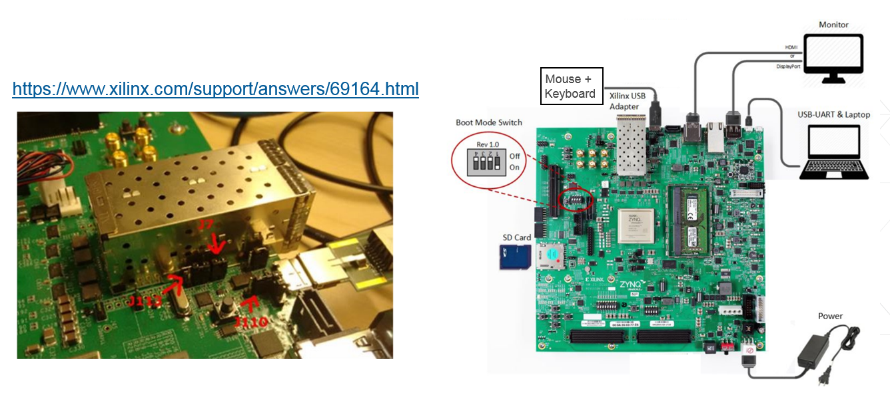

Use the serial terminal software such as putty or Xterm with the setting: 115,200 baud rate, 8 data-bit, 1 stop-bit and none parity. 

Insert the SD card in the slot and power on, if correctly, you will see Linux booting from the serial terminal. 

After booting, login in with username: __root__ and password: __root__. 


First, you need to install DNNDK on the board. Run the following commands: 
```
  cd /root/zu9_arm64
  ./install.sh
```
Then you need to copy the two elf files 'dpu_resnet50_0.elf' and 'dpu_resnet50_2.elf' generated by dnnc in AWS to the board. 

You can use __scp__ command to send these two files from AWS to your computer.

Then connect an ethernet cable between the board and your computer and setup the 
IP address as follows: 

For Linux, run the command:
```
ifconfig eth1 192.168.1.101 netmask 255.255.255.0
```
For Windows, please set the IP address accordingly.

From the board, run ifconfig to check the IP address of eth0. If it is not 192.168.1.*, run the following command: 
```
ifconfig eth0 192.168.1.100 netmask 255.255.255.0
```
Then you are able to use __scp__ or __pscp__ to transfer these two elf files to the board:
```   
scp dpu_resnet50_*.elf root@192.168.1.100:/root/samples/resnet50/model
```

2. To generate the hybrid executable, go to /root/samples/resnet50/ and run command make, which first compiles application source to CPU ELF object file and then link it against the DPU 'dpu_resnet50_0.elf' and 'dpu_resnet50_2.elf' two ELF object files produced by dnnc to generate the hybrid executable.

3. In the directory /root/samples/resnet50, run command ./resnet50 and see its output.

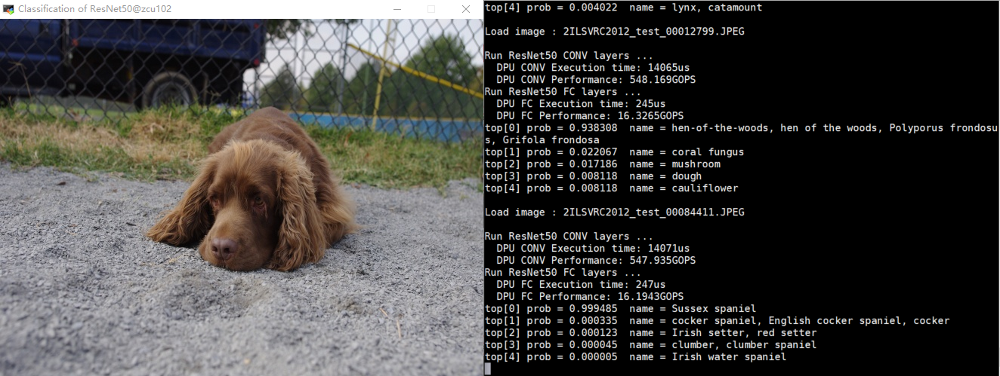

This concludes the experience DNNDK with Resnet50 session. During this session you examined the following tasks: 

1. Quantize the pre-trained float-point network model to fixed-point quantized model
2. Check the network accuracy after the quantization
3. Compile the quantized model to generate ELF object files for DPU kernels
4. Have a basic understanding of programming main.cc with high-level DNNDK APIs
5. Make the hybrid compilation to generate the hybrid executables which runs on Xilinx embedded platform
6. Run the executables on Xilinx embedded platform to see the visual output

### Going Further with SSD

In this module you will go further to quantize, compile and deploy to Xilinx ZU102 board with a pre-trained SSD network. 

SSD (https://arxiv.org/abs/1512.02325) is a commonly used real-time object detection network for a wide range of applications. The backbone of SSD can use different networks such as Resnet, VGG, Googlenet etc. In this experiment, we will use SSD with VGG16 as the backbone. 

The overall flow of SSD compilation is similar to the previous Resnet50 lab. It is quite straightforward to go through the lab by repeating the steps from the Resnet50 lab. 

The working directory is ~/Compiler/ssd. 

However, you should remove the __Reshape__ layer, and the two subsequent layers, from __deploy.prototxt__ in the ~/Compiler/ssd/decent_output folder before the compilation. 

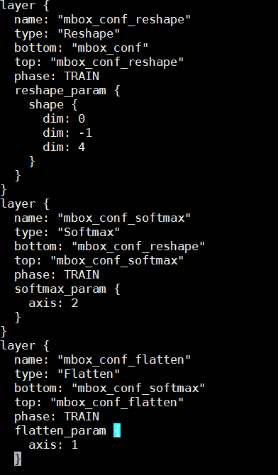

These layers are not supported by the DPU. They have  no impact on the result. If you don't remove these layers before running ./dnnc_ssd.sh, an error will occur as shown below: 

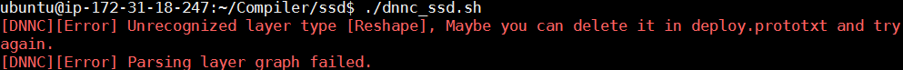

The modified deploy.prototxt has been put in ~/Compiler/ssd/decent_output_fix folder. You can use it to replace the original deploy.prototxt generated by ./decent_ssd.sh 

After the hybrid compilation, the final executable file is located in /root/samples/video_analysis of the board.

View the ./video_analysis video/structure.mp4 file.

You will see the following display with bounding box around different classes of objects. The input image size is ??? and we can achieve ?? fps. 

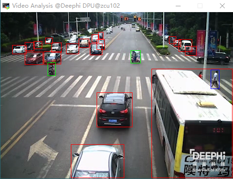

We are successfully running a modern object detection network to detect the vehicles, motorcycles and pedestrians in the city traffic @ ??? fps on an embedded platform. This is done within a few minutes with the help of DNNDK. 

After completing this section, you will:

1. Be more familiar with the DNNDK end-to-end flow by repeating the steps
2. Have a basic concept and understanding of modifying the prototxt file to suit DNNDK/DPU
3. Be able to build a real-time multi-class object detection demo on Xilinx embedded platform in minutes.

## Wrap-Up and Next Steps
It is now time to wrap-up this workshop. Please follow these steps to close your RDP session and terminate your instance. It is important to always stop or terminate AWS EC2 instances when you are done using them. This is a recommended best practice to avoid unwanted charges.

### Terminating your instance
* Click the 'X' icon to close your RDP client.
* On your local machine, return to your browser and to the tab showing the EC2 Console and the details of your running instance. 

If necessary, use the link which was emailed to you to return to the proper web page.
* In the EC2 Console, make sure your instance is selected
* Click the Actions > Instance State > Stop.
Congratulations!
You have successfully completed all the modules of Machine Learning for Embedded Workshop.

1. You started a pre-configured EC2 P2 instance and connected to it using a remote desktop client.
2. You experienced the quantization, compilation and deployment of pretrained Resnet50 with DNNDK for Xilinx embedded platform
3. You used DNNDK to create a real-time multi-class object detection demo with SSD in minutes
4. You closed your RDP session and properly stopped your P2 instance.

### Next steps

To take your experience further, we recommend the following next steps:

1. Download the DNNDK user guide from http://www.deephi.com/technology/dnndk and have a deeper understanding of how it works
2. Try to write the main.cc file for inception_v1 using DNNDK APIs and build the executables
3. Build a working face detection demo using Avnet Ultra96 board with a USB camera

