F# XDF 2018 Workshop 
# Machine Learning for Embedded

## Introduction
Welcome to the XDF 2018 machine learning for embedded workshop. During this session you will gain hands-on experience with Deephi DNNDK, and learn how to quantize, compile and deploy pre-trained network models to Xilinx embedded SoC platforms. 

### Overview of DNNDK flow
The architecture DNNDK and its development flow are pictured below:

**Elements of DNNDK:**


**DNNDK Flow:**


**DNNDK Compilation Process:**


1. DNNDK is a tool suite which is designed specifically to deploy deep neural networks(DNNs) to Xilinx FPGA platforms with high efficiency and productivity.
2. DNNDK is comprised of quantizer, compiler, assembler, linker, and other useful utilities such as profiler, simulator and run-time libraries to increase the productivity of developing DNN applications with Xilinx embedded platforms.
3. An embedded DNN application consists of a hybrid executable including Deephi Deep-learning Processing Unit (DPU) kernels in the programmable logic(PL) region and CPU kernels in the processor(PS) of Xilinx embedded SoC. 
4. DNNDK provides high-level user-space APIs in C++ to hide the low-level details for machine learning algorithm and application developers.

### Overview of the Machine Learning for Embedded Workshop modules

This developer workshop is divided into 6 modules. You should complete each module before proceeding to the next.
1. **Connecting to your P2 instance**: You will start an EC2 P2 instance where DNNDK tool and project files are located and connect to it using SSH or remote desktop client. 
2. **Experiencing DNNDK with Resnet50**: Let us start with a classical image classification example. In this module you experienced the quantization, compilation and deployment of pretrained Resnet50 with DNNDK for Xilinx embedded platform

3. **Go further with SSD**: The object detection is a common task for embedded machine learning. You will build a real-time multi-class object detection demo using SSD network in minutes. 

4. **Try face detection with Densebox**: Let us try a live-I/O machine learning example which is more interactive. You will build a real-time face detection application with Densebox network using a USB camera.

5. **Practice DNNDK with Inception V1 (Googlenet)**: You will have hands-on practice to write some code in main.cc and Makefile then build and run Inception V1(Googletnet) with DNNDK.

1. **Wrap-up and next steps**: Explore next steps to continue your DNNDK experience after the machine learning for embedded Workshop.

For your convenience, all the modules of this Developer Workshop will use the script and dataset which have been prepared for you.

## Connecting to your P2 instance
In this module you will start an EC2 P2 instance and connect to it using SSH or remote desktop client. Once connected, you will be able to use the tool with all needed scripts and dataset.
For this event, each registered participant will be required to start an EC2 P2 instance, therefore, participants need to have experience with:
* AWS account and launching EC2 instances
* Connecting to a running instance using SSH or Windows Remote Desktop

### Log in AWS and start the instance
You should have received a piece of paper which has the Account ID, IAM user name and Password.

    Account ID: xilinx-aws-f1-developer-labs
    IAM User name: userxx (for example: user7)
    Password: xdf_deephi

If you don’t have it, please raise your hand and ask for help.

1. User your web browser to visit the following URL:
   console.aws.amazon.com/ec2/v2/home?region=us-west-2#Instances:tag:userid=\<your IAM user name\>;sort=tag:Name

   For example, if your user name is "user7", the correct URL would be:
    https://console.aws.amazon.com/ec2/v2/home?region=us-west-2#Instances:tag:userid=user7;sort=tag:Name

1. Login in with the assigned Account ID, user name and Password as shown.

    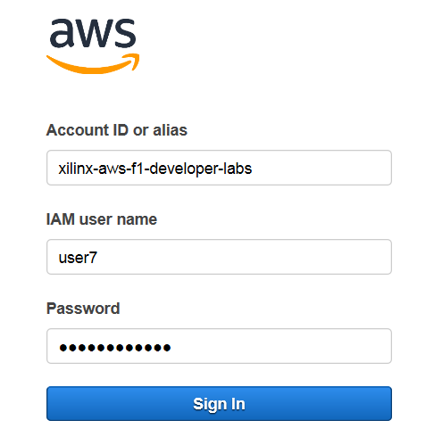

2. You will see a list of instances. Select the instance associated with your user name, click __*Actions > Instance State > Start*__. Then click "Yes, start" button in the Start Instances dialog. 
   
**AWS Instances:**


4. The startup time is about 10 ~20 seconds and you need to refresh the browser to see the status update. You will see the instance state becomes running and there is an IPv4 public IP address associated with it. Later, you will use this IP address for SSH or Remote Desktop Connection to access the working directory. 
   
**AWS Instance Runing:**
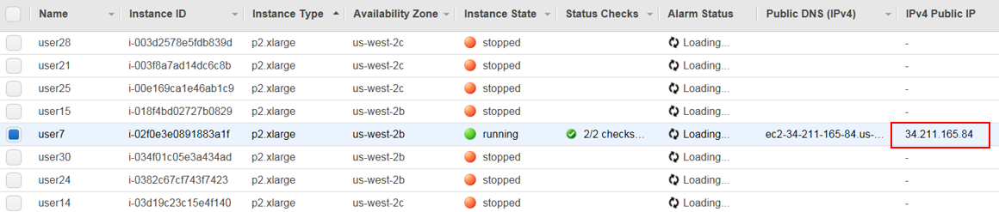


There are two ways to connect to the instance - SSH and RDP. Directions for both follow.

### Connect to your instance using SSH
1. In the SSH client, use the IPv4 Public IP of your instance:

    ssh ubuntu@\<your IPv4 Public IP\>

**SSH Client:**
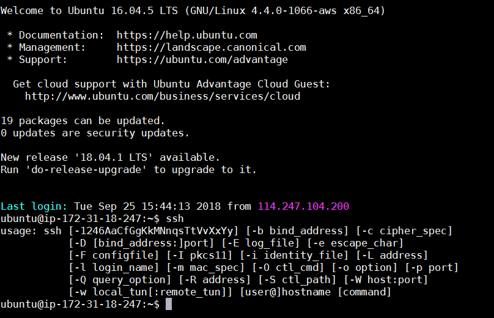

2. Go to the the working directory 
    ```
    cd ~/dnndk/dp-8020
    ls
    ```

You will see the following. 

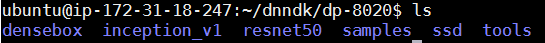

You can see there are six folders which are respectively,
- densebox: lab files for face detection with Densebox
- inception_v1: lab files for Inception V1(Googletnet)
- resnet50: lab files for resnet50
- ssd: lab files for SSD
- samples: files for hybrid compilation
- tools: Quantization tool decent and Compilation tool dnnc


### Connect to your instance using a remote desktop client
The instance you just started should now be configured with remote desktop protocol (RDP) services.
1. From your local machine, start a remote desktop protocol client
* On Windows: press the Windows key and type "remote desktop". 
    * You should see the "Remote Desktop Connection" in the list of programs.
    * Alternatively you can also simply type mstsc.exe in the Windows run prompt.
* On Linux: RDP clients such a Remmina or Vinagre are suitable.
* On macOS: use the Microsoft Remote Desktop from the Mac App Store.
2. In the RDP client, enter the IPv4 Public IP of your instance.
3. IMPORTANT: Before connecting, set your remote desktop client to use 24-bit or less for color depth
* On Windows: In the bottom-left corner of connection prompt, click Options, then select the Display tab and set Colors to True Colors (24 bit)
4. Click Connect. This should bring up a message about connection certificates.
5. Click Yes to dismiss the message. The Remote Desktop Connection window opens with a login prompt.
   


6. Login with the following credentials:
* User: ubuntu
* Password: xdf_deephi

    Click Ok. The RDP connection may fail on the first login, press OK and re-login. You should now be connected to the remote P2 instance running Ubuntu.

7. Open a new terminal as below. 

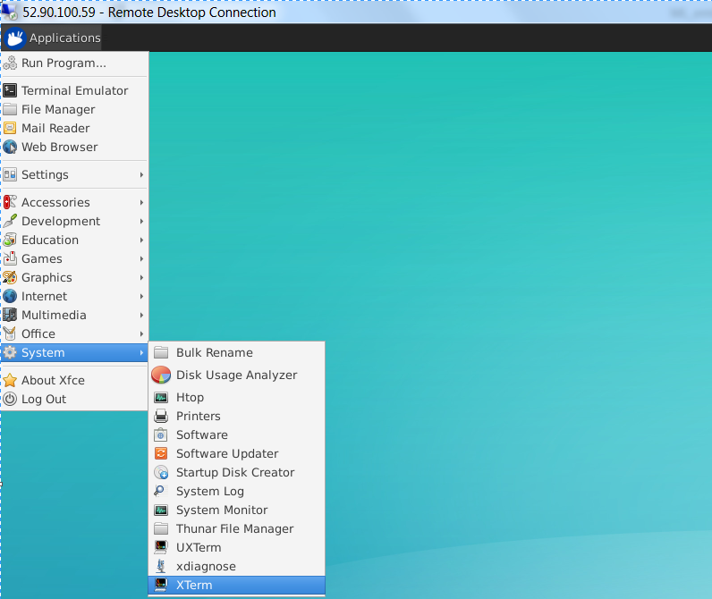

8. Go to the working directory 
    ```
    cd ~/dnndk/dp-8020
    ls
    ```

You will see the following:  
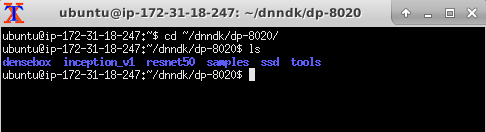

Now you've connected to the P2 instance and know the location of the working directory. Let us move to the next step. 


## Experiencing DNNDK with Resnet50

In this module you will have a hands-on experience of Deephi DNNDK to quantize, compile,and deploy to Deephi DP-8020 card with a pre-trained Resnet50 network. 

Resnet50 (https://arxiv.org/abs/1512.03385) is an image classifier trained with the Imagenet dataset. 
You will go through the following steps,
1. Quantization to generate the fixed-point network model
2. Compilation to generate DPU kernels
3. View main.cc written with DNNDK APIs
4. Hybrid compilation to produce the executable for DP-8020 board
5. Run it on DP-8020 board to see the result

Look into ~/dnndk/dp-8020/resnet50: 

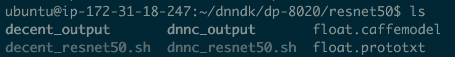

 The directories and files are organized as follows, 

* float.prototxt: 	pre-trained Caffe network model file to describe the network structure and parameter of each layer
* float.caffemodel:	pre-trained Caffe float-point (FP32) weight file
* decent: Deephi's quantization tool
* dnnc:	DeephiNeural Network Compiler
* decent_resnet50.sh: script for Resnet50 quantization
* dnnc_resnet50.sh: script for Resnet50 compilation
* decent_output: the output folder of Resnet50 quantization
* dnnc_output: the output folder of Resnet50 compilation

The directory and file arrangement of Inception_v1 and SSD are very similar. 

If you have interest, feel free to have a look into float.prototxt in ~/dnndk/dp-8020/resnet50/

The first layer on top is ImageData type with calibration images for the quantization. DNNDK does not support the mean file e.g. mean.binaryproto. Instead we use 3 mean values as shown below. 

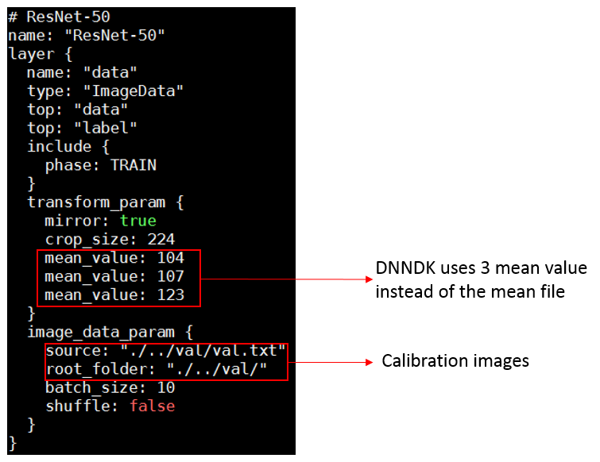

At the bottom of float.prototxt, two 'Accuracy' type layers have been added to compute top-1 and top-5 accuracy. 

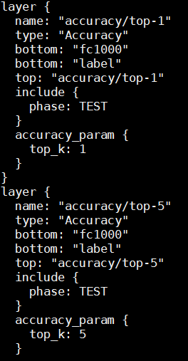

### Quantization with decent

decent is used to convert a pre-trained floating point (FP32) network model to a fix-point (INT8) model without hurting the accuracy. Using 8-bit calculations help your models run faster and use less power. This is especially important for many embedded applications that can't run floating point code efficiently.

The network models we use are trained by Caffe. DNNDK toolchain support for Tensorflow will come soon. 

We've created a script decent_resnet50.sh for you. 

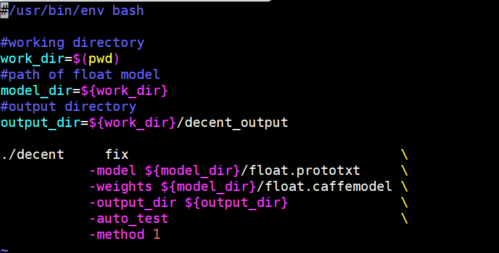

The command above quantizes the float-point model and automatically checks the accuracy of the quantized model.

Run: 
```
./decent_resnet50.sh
```

It takes about 4 minutes to complete.

During the execution, you can see some output information scrolling on the screen. The figure below shows how DNNDK uses calibration technique to measure the dynamic range of each layer without the time-consuming retrain process. 
          
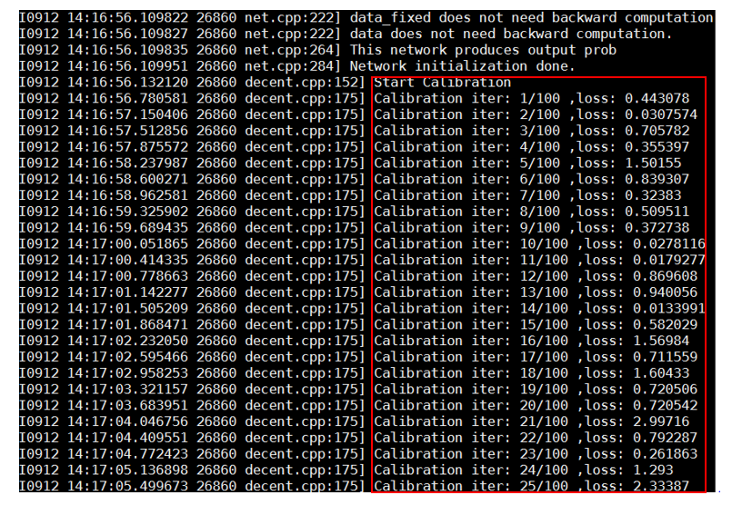
          
At the end, it checks the accuracy of the quantized model and generates the deploy.prototxt and deploy.caffemodel which are the input to the next step. 

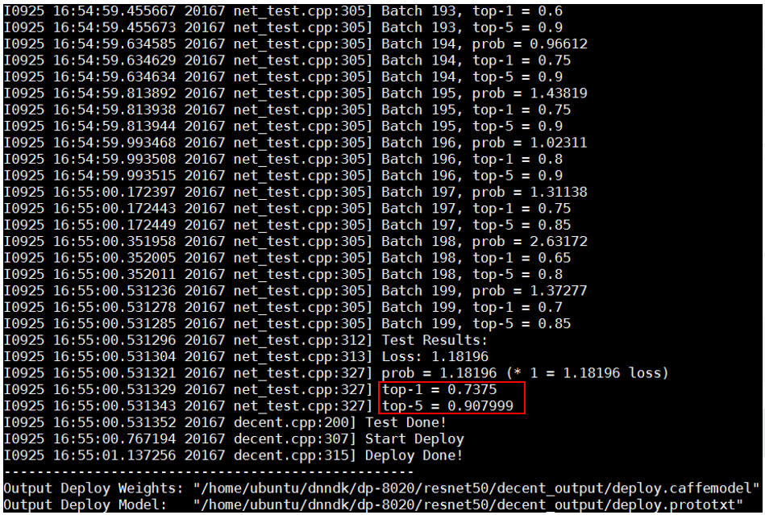
          
This concludes the quantization process. We successfully quantized the float-point Resnet50 model to the fix-point model and achieved with a good accuracy (top-1 0.7375, top-5 0.908) vs float-point accuracy (top-1 0.744, top-5 0.914). The decent quantization is simple, fast and accurate. 

Let us go to the next step. 


### Compilation with dnnc

In this step, you will use dnnc, Deephi Neural Network Compiler, to compile the quantized fixed-point model into DPU kernels which are ELF format object files containing the DPU instructions and parameters for the network model. Please note DPU is Deephi's Deep Learning IP core for Xilinx FPGA devices.

All the compilation will be done in AWS which generates the final executables to run on DP-8020 board. The DNNDK compilation has two phases: the 1st phase uses dnnc to generate DPU kernel ELF files; the 2nd phase, which is the hybrid compilation, all the DPU and CPU ELF object files and other necessary libraries (including DNNDK libraries) are linked together to generate the final executables. 

At this time, you will go through the 1st phase. 

A script dnnc_resnet50.sh has been created. 

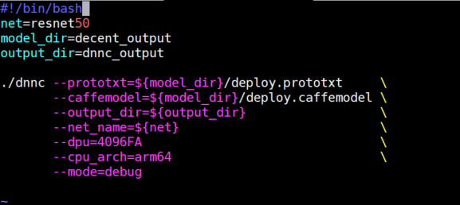

If you want to understand the meaning of the parameters of dnnc, just run ~/dnndk/dp-8020/tools/dnnc

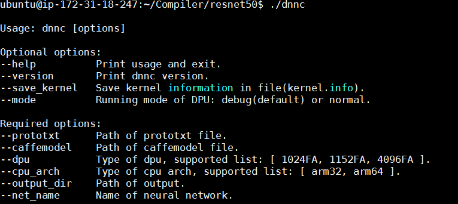

In this case, we target DP-8020 platform which uses Cortex-A53 based ZU9EG device, so the option “arm64” is used and the DPU IP core option “B4096FA” is chosen for dnnc. The details of the DPU IP core are beyond the scope of this workshop. Contact Xilinx for further info. 

Run dnnc:
```
./dnnc_resnet50.sh 
```

It takes about 1 minutes to complete. 2 kernels are generated. Kernel resnet50_0 will run on DPU, including CONV, BN, POOL, RELU, FC layers while Kernel resnet50_1 will run on ARM to implement the softmax layer. 

In general, if a certain layer cannot run on DPU, it will be executed on ARM. So the networks will be automatically partitioned into several segments by the dnnc compiler. Each segment corresponds to one kernel, either in DPU or CPU. 

Please contact Xilinx if you want to know if any specific layer has been supported by DNNDK/DPU. The details of layer support are beyond the scope of this workshop.
          
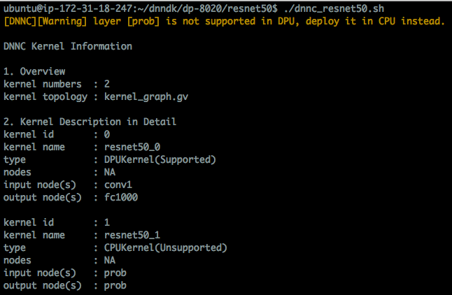
    
dpu_resnet50_0.elf is generated in dnnc_output folder, which are the output of dnnc. It corresponds to the DPU kernel described previously. This elf file will be used in the next phase to generate the final executables.

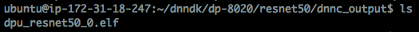

### Use DNNAK APIs to program Resnet50 in main.cc 

To simplify the machine learning application programming, high-level DNNDK APIs written in C++ are provided for developers to write a main.cc file. The main.cc is in charge of DPU kernel management, CPU kernel implementation as well as the interaction between kernels and the system such as video peripherals. 

main.cc file for Resnet50 is in ~/dnndk/dp-8020/samples/resnet50/src/

Examine the code in main.cc to get familiar with DNNDK APIs. The following shows a code snippet of function main() in main.cc:

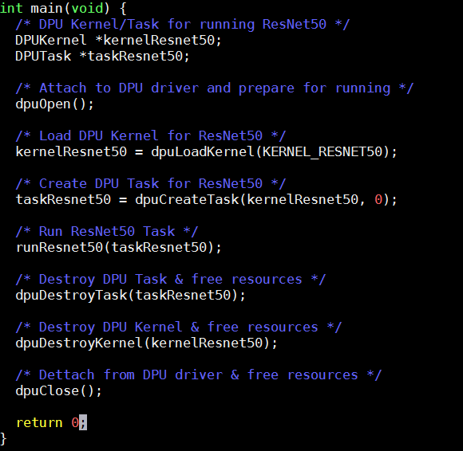
    
The main operations are: 
* Call __dpuOpen()__ to open DPU device
* Call __dpuLoadKernel()__ to load DPU kernel resnet50_0 & resnet50_2 generated by dnnc
* Call __dpuCreateTask()__ to create task for DPU kernel resnet50_0 & resnet50_2
* Call __runResnet50()__ to do image classification 
* Call __dpuDestoryTask()__ to destroy Task and free its resources
* Call __dpuDestroyKernel()__ to destroy Kernel and free its resources
* Call __dpuClose()__ to close DPU device 

Please make sure the kernel and node names are aligned with the output log in dnnc compilation, shown as follows,

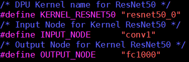
    
If incorrect node name is specified, the following kind of error will be reported while launching the running of ResNet50 demo:

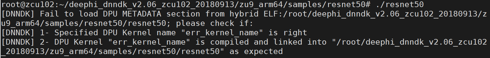

The following shows a code snippet of function runResnet50(): 

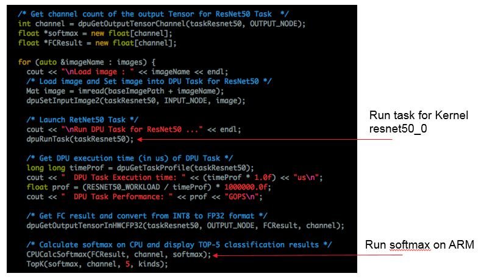

__runResnet50()__ does the following tasks: 
1. Read picture and set it as the input to DPU kernel resnet50_0 by calling dpuSetInputImage() API
2. Call dpuRunTask() to run Conv, Relu, Pool, FC operation etc. for DPU Kernel resnet50_0
3. Do Softmax operation on CPU using the output of full connection operation as input.
4. Output the top-5 classification category and the corresponding probability

For details of DNNDK APIs, please refer to DNNDK User Guide which can be downloaded from Deephi website - http://www.deephi.com/technology/dnndk 

### Hybrid Compilation & Running on Hardware Board

1. Copy the DPU kernel elf file from ~/dnndk/dp-8020/resnet50/dnnc_output/ into ~/dnndk/dp-8020/samples/resnet50 folder in which run make, the final executable file resnet50 will be generated.

2. Prepare hardware environment
   
    Deephi DP-8020 is used as the hardware platform for this workshop. A 16GB SD card which holds the boot image and necessary demo files has been provided as the boot device. 

    A 1080p DP monitor is required as the display. A USB UART cable and Ethernet cable are required to connect with your computer. A USB dongle is needed to connect with a USB keyboard and mouse as the input devices.

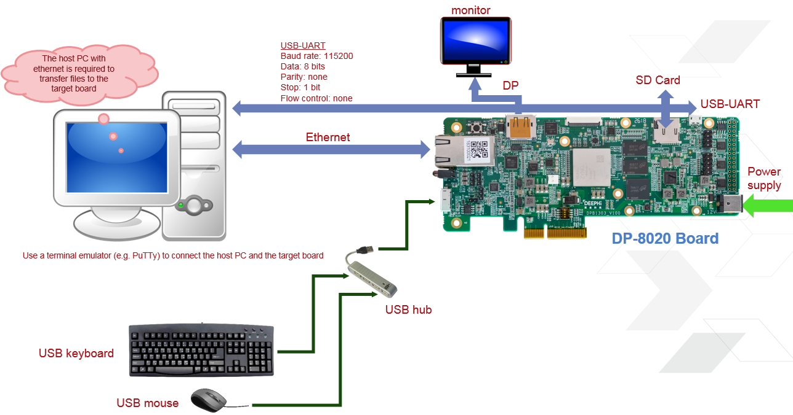

Use the serial terminal software such as putty or Xterm with the setting: 115,200 baud rate, 8 data-bit, 1 stop-bit and none parity.

Insert the SD card in the slot and power on, if correctly, you will see Linux booting from the serial terminal. After booting, login in with username: root and password: root.

Then you need to copy the final executable file “resnet50” in ~/dnndk/dp-8020/samples/resnet50/ from AWS to the board.

First, you can use scp command to copy the file from AWS to your computer. Then connect an ethernet cable between the board and your computer and setup the 
IP address as follows: 

For Linux, run the following command:

    ifconfig eth1 192.168.0.1 netmask 255.255.255.0

For Windows, please set the IP address accordingly. 

From the board, run ifconfig to check the IP address of eth0. If it is not 192.168.0.*, run the following command:

    ifconfig eth0 192.168.0.2 netmask 255.255.255.0

Then you are able to use __scp__ or __pscp__ to transfer these two elf files to the board:

    scp resnet50 root@192.168.0.2:/root/samples/resnet50/ 


1. In the directory /root/samples/resnet50, run command ./resnet50 and see its output.

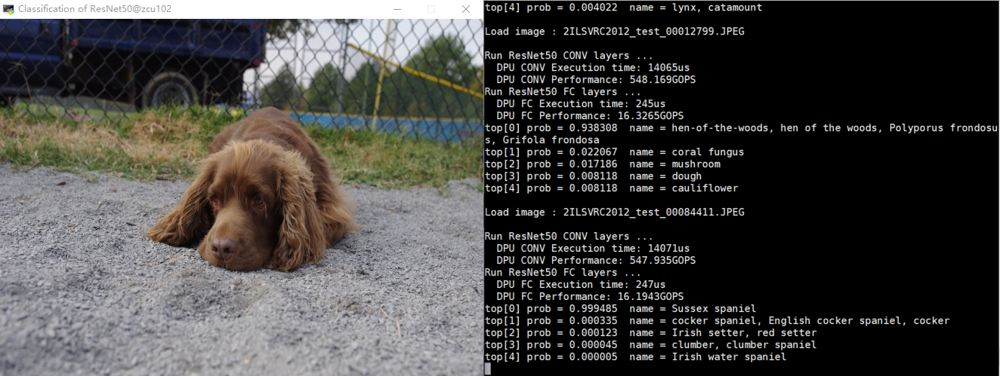

After the completion of this session, you will be able to: 
1. Quantize the pre-trained float-point network model to fixed-point quantized model
2. Check the network accuracy after the quantization
3. Compile the quantized model to generate ELF object files for DPU kernels
4. Have a basic understanding of programming main.cc with high-level DNNDK APIs
5. Make the hybrid compilation to generate the hybrid executables which runs on Xilinx embedded platform
6. Run the executables on Xilinx embedded platform to see the visual output

## Going Further with SSD

In this module you will go further to quantize, compile and deploy to Deephi DP-8020 board with a pre-trained SSD network. 

SSD (https://arxiv.org/abs/1512.02325) is a commonly used real-time object detection network for a wide range of applications. The backbone of SSD can use different networks such as Resnet, VGG, Googlenet etc. In this experiment, we will use SSD with VGG16 as the backbone. 

The overall flow of SSD experiment is almost the same with the previous Resnet50 lab.

The working directory is ~/dnndk/dp-8020/ssd/

It is quite straightforward to go through the lab by repeating the steps in Resnet50.
1. Run **./decent_ssd.sh** in ~/dnndk/dp-8020/ssd to generate depoly.prototxt and deploy.caffemodel in ~/dnndk/dp-8020/ssd/decent_output
2. Run **./dnnc_ssd.sh** to generate DPU kernel ELF file dpu_ssd.elf in ~/dnndk/dp-8020/ssd/dnnc_output.
3. Copy this ELF file into ~/dnndk/dp-8020/samples/video_analysis/model and run make, the final executable file video_analysis will be generated.
4. Then you need to copy the executable file video_analysis to /root/samples/video_analysis of the DP-8020 board and run

    ./video_analysis video/structure.mp4

You will see the following display with bounding box around different classes of objects.
The input image size is 480x360 and we can achieve 28 fps.


We are successfully running a modern object detection network to detect the vehicles, motorcycles and pedestrians in the city traffic in real time on an embedded platform. This is done within a few minutes with the help of DNNDK.

After completing this section, you will:

1. Be more familiar with the DNNDK end-to-end flow by repeating the steps
2. Be able to build a real-time multi-class object detection demo on Xilinx embedded platform in minutes.


## Try face detection with Densebox
It is easy to build a live-I/O embedded ML application with DNNDK. Now let us try to do real-time face detection with Densebox (https://arxiv.org/abs/1509.04874) using USB camera. Densebox is another popular object detection network with fully convolutional framework. We have a SDSoC ML workshop at XDF which shows how to create this demo step-by-step. You are more than welcome to join.
Let us continue our experiment. Enter ~/dnndk/dp-8020/densebox folder, the content is shown below:

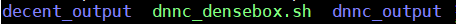

The Densebox network is already quantized and stored in the decent_output folder.

### Compilation with dnnc

Use dnnc_densebox.sh to compile the network into DPU kernel ELF file, the content of script is as follow:


The kernel information is as follow:


### Run densebox
Copy the ~/dnndk/dp-8020/densebox/dnnc_output/dpu_densebox.elf file to ~/dnndk/dp-8020/samples/face_detection/model folder.

Run **make** in ~/dnndk/dp-8020/samples/face_detection, the final executable file face_detection will be generated in the same folder.

Copy the executable to dp-8020 board, connect the USB camera and DP monitor provided then run:

    ./face_detection

You will see faces detected in real-time with bounding boxes like below:

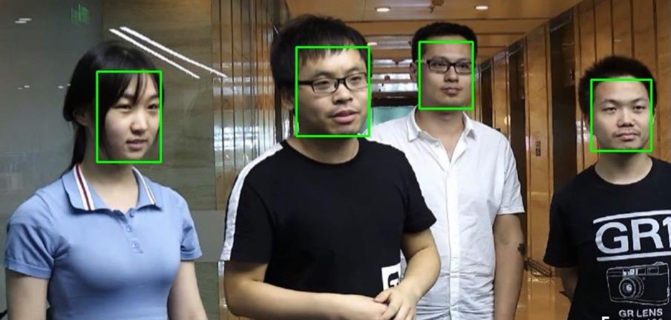


## Practicing DNNDK with Inception V1(Googlenet)

In this module you will get hands-on experience writing code in main.cc, and using a Makefile to build and run Inception V1(Googlenet) with DNNDK.
Inception V1 (https://arxiv.org/abs/1409.4842) is another popular image classifier trained with the Imagenet dataset.

You will go through the following steps,
1. Quantization to generate the fixed-point network model
2. Compilation to generate DPU kernels
3. Finish main.cc using DNNDK APIs and Makefile
4. Hybrid compilation to produce the executable for DP-8020 board
5. Run it on DP-8020 board to see the result

Change directory to ~/dnndk/dp-8020/inception_v1. The directories and files are organized similar to the Resnet50 project, as shown below:

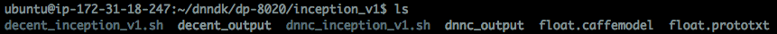

### Quantization with decent
The script **decent_ inception_v1.sh** is similar to the resnet50 script.


Run decent

    ./decent_ inception_v1.sh

It takes about 4 minutes to complete. At the end, it checks the accuracy of the quantized model and generates the deploy.prototxt and deploy.caffemodel which are the input to the next step.

### Compilation with dnnc
In this step, use dnnc to compile the quantized fixed-point model into DPU kernels ELF files.

Run dnnc

    ./dnnc_ inception_v1.sh

It takes about 1 minutes to complete. 2 kernels are generated. Similar to Resnet50, kernel inception_v1_0 will run on DPU, while Kernel inception_v1_1 will run on ARM for softmax layer.

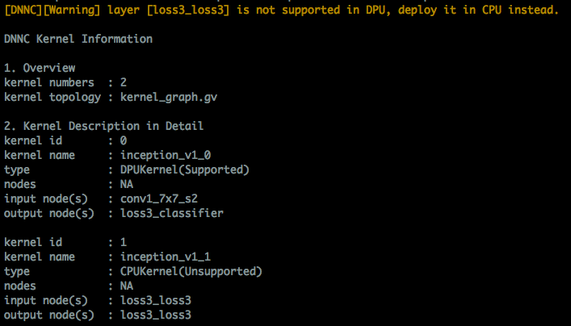

dpu_inception_v1_0.elf is generated in dnnc_output folder. It corresponds to one DPU kernel described above. The elf file and kernel/input/output node names will be used in the next step to generate the final executables. We have dumped the kernel info in the ~/dnndk/dp-8020/inception_v1/kernel.info log file for the later use.

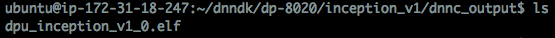

### Finish main.cc and Makefile
We need you to finish the main.cc in ~/dnndk/dp-8020/samples/inception_v1/src folder with DNNDK API and the Makefile in ~/dnndk/dp-8020/samples/inception_v1 folder.

Please refer to main.cc and Makefile of the resnet50 project for an example of how to finish it.

The missing elements of main.cc and the Makefile which you need to finish are shown in the following figures. Don’t worry if your code is incorrect. It will not cause any unrecoverable crashes. The message like undefined kernel or node will be displayed when you run it on the board.

**main.cc DEFINES**
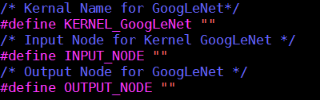

**main.cc Function**
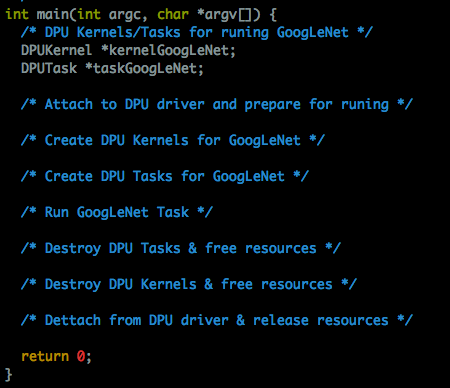

**Makefile**
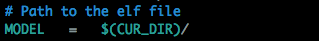

After you have completed the coding, you should have a better understanding of how to write application code with DNNDK APIs and how to use the generated DPU kernels in the compilation process.

If you are not able to finish the coding, which is not unusual for the first time, you can find the completed main.cc and Makefile in ~/dnndk/dp-8020/samples/inception_v1/.backup folder. You can view the completed code, and use it to complete the lab. 

Copy the completed main.cc to ~/dnndk/dp-8020/samples/inception_v1/src and copy the completed Makefile to ~/dnndk/dp-8020 /samples/inception_v1

### Run inception v1
Copy the DPU kernel elf file dpu_inception_v1_0.elf from ~/dnndk/dp-8020/inception_v1/dnnc_output into ~/dnndk/dp-8020/samples/inception_v1 folder and run make. The final executable file is generated in same folder. 

Copy the executable onto DP-8020 board and run:

    ./inception_v1

You will see the following display with image and the top-5 probability.

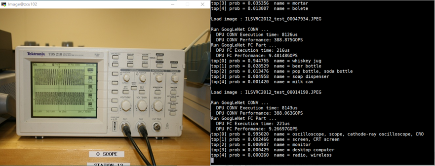


## Wrap-Up and Next Steps
It is now time to wrap-up this workshop. Please follow these steps to close your RDP session and terminate your instance. It is important to always stop or terminate AWS EC2 instances when you are done using them. This is a recommended best practice to avoid unwanted charges.

### Terminating your instance
* Click the 'X' icon to close your RDP client.
* On your local machine, return to your browser and to the tab showing the EC2 Console and the details of your running instance. 

    * If necessary, use the link which was emailed to you to return to the proper web page.
* In the EC2 Console, make sure your instance is selected
* Click the **Actions > Instance State > Stop**.

### Congratulations!
You have successfully completed all the modules of Machine Learning for Embedded Workshop.

1. You started a pre-configured EC2 P2 instance and connected to it using a remote desktop client
2. You experienced the quantization, compilation and deployment of pretrained Resnet50 with DNNDK for Xilinx embedded platform
3. You used DNNDK to create a real-time multi-class object detection demo with SSD in minutes
4. You built a real-time face detection demo with Densebox network using USB camera as input
5. You learned to finish main.cc and Makefile with DNNDK APIs and kernel/node name info by dnnc for Inception V1 by reference to resnet50 example
6. You closed your RDP session and properly stopped your P2 instance.

### Next steps

To take your experience further, we recommend the following next steps:

1. Download the DNNDK user guide from http://www.deephi.com/technology/dnndk and have a deeper understanding of how it works
2. Try to build a real-time pedestrian detection application with SSD using USB camera by reference to the face detection example

